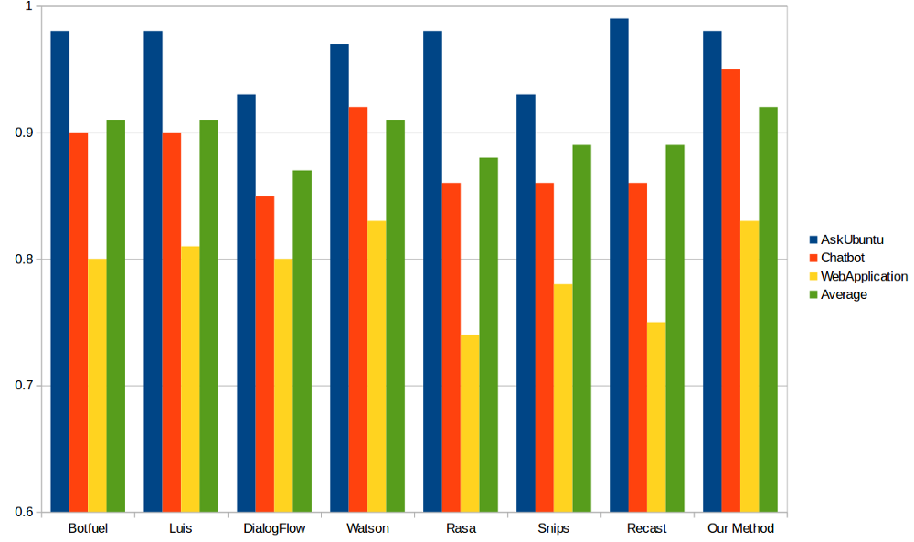

# Know your Intent : Intent Classification Using Semantic Hashing

Intent Classification using Semantic Hashing as Featurizer. We successfully achieved State-of-the-Art results in three datasets: 
1. Ask Ubuntu Coprus
2. Web Application Corpus
3. Chatbot Corpus

Read about the method used in more details [here](https://medium.com/@shridhar743/know-your-intent-sota-results-in-intent-classification-8e1ca47f364c)

The results were compared with other Chatbot provider services like Google DialogueFlow, Facebook Wit AI, IBM Watson, Recast AI, Botify and so on and this is how the results look :




If you use the work, please cite the authors:

```
@article{shridhar2018subword,
  title={Subword Semantic Hashing for Intent Classification on Small Datasets},
  author={Shridhar, Kumar and Sahu, Amit and Dash, Ayushman and Alonso, Pedro and Pihlgren, Gustav and Pondeknath, Vinay and Simistira, Fotini and Liwicki, Marcus},
  journal={arXiv preprint arXiv:1810.07150},
  year={2018}
}
```
