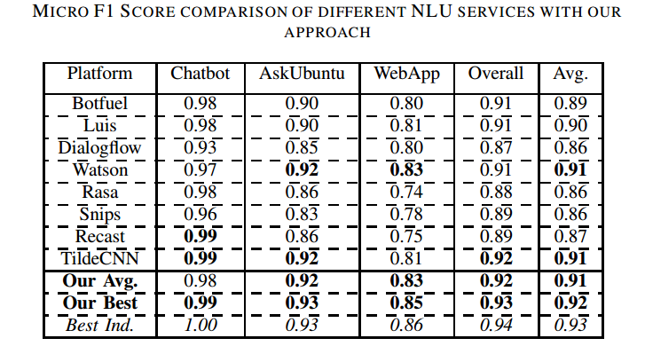

# Know your Intent : Intent Classification Using Semantic Hashing

Implementation of [Subword Semantic Hashing for Intent Classification on Small Datasets](https://arxiv.org/abs/1810.07150).


```
@article{shridhar2018subword,
  title={Subword Semantic Hashing for Intent Classification on Small Datasets},
  author={Shridhar, Kumar and Sahu, Amit and Dash, Ayushman and Alonso, Pedro and Pihlgren, Gustav and Pondeknath, Vinay and Simistira, Fotini and Liwicki, Marcus},
  journal={arXiv preprint arXiv:1810.07150},
  year={2018}
}
```

------------------------------------------------------------------------------------------------------------------------------
### Dataset

Intent Classification using Semantic Hashing as Featurizer was used. We successfully achieved State-of-the-Art results in three datasets: 
1. [Ask Ubuntu Coprus](https://github.com/sebischair/NLU-Evaluation-Corpora)
2. [Web Application Corpus](https://github.com/sebischair/NLU-Evaluation-Corpora)
3. [Chatbot Corpus](https://github.com/sebischair/NLU-Evaluation-Corpora)

Read about the details in this [blog](https://medium.com/@shridhar743/know-your-intent-sota-results-in-intent-classification-8e1ca47f364c)

------------------------------------------------------------------------------------------------------------------------------

### Results

The results were compared with other NLU service providers like Google DialogueFlow, IBM Watson, Recast AI, Botify, RASA, Snips and so on and a comparison was drawn:




-----------------------------------------------------------------------------------------------------------------------------

### Contact

For any queries, contact: shridhar.stark@gmail.com

-----------------------------------------------------------------------------------------------------------------------------
